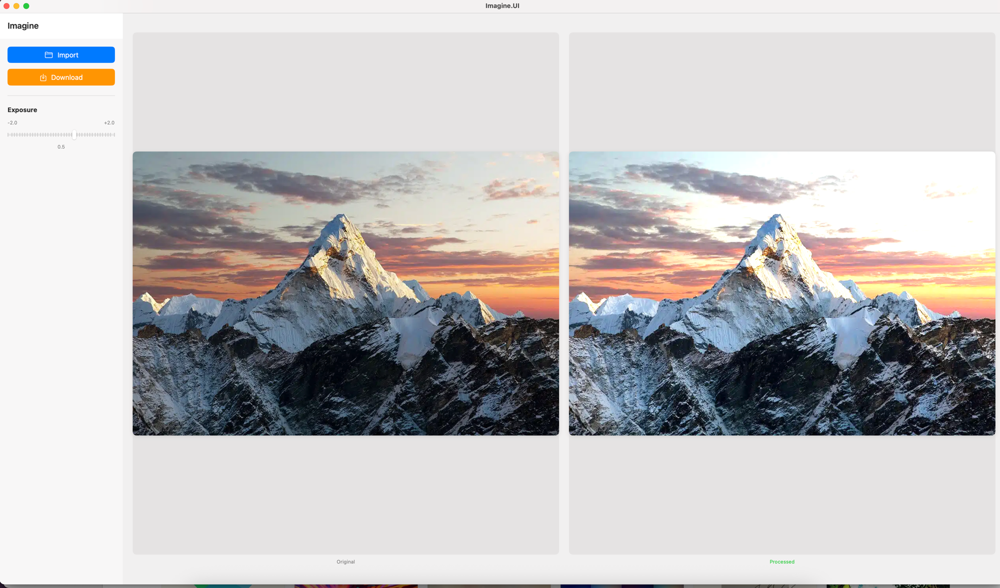

# Imagine

An image editor project built with modern technologies. Currently supports exposure modification.

# Building the Project

To build the project you need to be on MacOS and have protoc installed with swift-grpc 

Then you can do: 

`PROTOC_PATH=$(which protoc) swift build`

`PROTOC_PATH=$(which protoc) swift run`